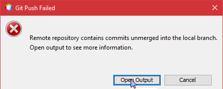

  <h1>Rendszerfejlesztés 2020.11.20.</h1>
  
  Bemutatjuk a GIT verziókezelő rendszer néhány alapműveletét.
   
  Úgy mint:
  <ul>
   <li>A repository chekoutolása (clone) (Györgyi Gyula)</li>
   <li>Új tartalom rögzítése (commit) (Boros Máté, Fűkő Erik)</li>
   <li>Új fejlesztési ág (branch) létrehozása (Györgyi Gyula)</li>
   <li>Az új branch-ben történt változtatások ellenőrzése (pull request) </li>
   <li>Az elfogadott változtatások rögzítése és beolvasztása a fő ágba (merge) </li>
  </ul>
  
  <h2>A repository chekoutolása (clone)</h2>
  <h3>Készítette: Györgyi Gyula</h3>
  A távoli repository tartalmának szerkesztéséhez szükség van egy helyi másolat készítésére.
   
  Ezt chekoutnak vagy clone nak nevezik.
   
  NetBeans-ben ezt a következő képpen lehet megtenni:
  <ol>
      <li>A fenti menüsorban keressük ki a <b>Team -> Git -> Clone</b>  lehetőséget 
           
          
      </li>
      <li>A felugró ablakban töltsük ki az üres mezőket: 
           
          a repo url-je (hol található az interneten), 
           
          A távoli tárolón használt felhasználónév valamint jelszó
           
          Valamint a az a helyi mappa, ahová letölti a repo tartalmát NetBeans.
      </li>
      <li>Majd kapcsoljunk a <b>Next</b> gombra </li>
      <li>
          Itt megkérdezi, hogy melyik távoli branch-eket szeretnénk szerkeszteni, letölteni. Jelöljük ki amelyikre szükségünk van.
           
          
      </li>
      <li> Ismét kapcsoljunk a <b>Next</b> gombra </li>
      <li>
          Végül a lemásolt repo helyéről és a másolás után szerkesztendő branch-ről tesz fel kérdésst.
           
          
          A jelölőnégyzetet vegyük ki, majd kapcsoljunk a <b>Finish</b> gombra
      </li>   
      <li>
          Ekkor elkezdi letölteni a repo tartalmát a megadottak szerint, ha végzett szerkeszthetjük.
          
      </li>
  </ol>
 <!----------------------------------------------------------------------------> 
    <h2>Új tartalom hozzáadása</h2>
    <ol>
        <li>
            Elsőnek commitoltam a gépemen lévő repoba.(Boros Máté)
             
            
        </li>
        <li>
            Az után a projektre jobb gombal majd aztán a git nevezetű menüpontba a push-t használva feltöltöttem ide.(Boros Máté)
             
            
        </li>
        <li>
            Elsőnek commitoltam a gépemen lévő repoba. (Boros Máté)
             
            
        </li>
        <li>
            Új fájl hozzáadása a repository-hoz (Fűkő Erik)
             
            
        </li>
  </ol>
   <!----------------------------------------------------------------------------> 

  
  <h2>Fejlesztési ágak összeolvasztása</h2>
  
  <ol>
    <li>
        Merge (Fűkő Erik)
         
        
    </li>
    
    <li>
        
    </li>
  </ol>
  
  <h2>A helyi változtartások feltöltése a távoli repoba</h2>
  
  <ol>
    <li>
      Pull (Fűkő Erik)
       
      
    </li>
  </ol>
  <b>Készítették:</b> Fűkő Erik, Boros Máté, Györgyi Gyula
 
